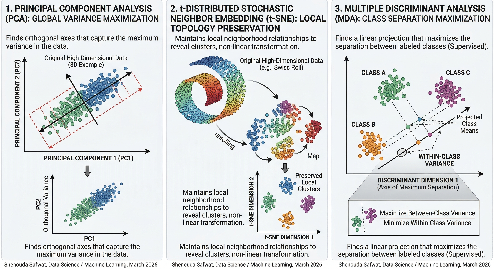

# Dimensionality Reduction Techniques: A Comparative Study of PCA, t-SNE, and MDA

## 👤 Author Information
* **Name:** Shenouda Safwat
* **Field:** Data Science / Machine Learning
* **Date:** March 2026

---

## 📝 Abstract
Dimensionality reduction is a critical preprocessing step in modern data science. As datasets grow in complexity, the **"curse of dimensionality"** makes visualization and model training increasingly difficult. This research explores three foundational techniques: **Principal Component Analysis (PCA)**, **t-Distributed Stochastic Neighbor Embedding (t-SNE)**, and **Multiple Discriminant Analysis (MDA)**. We discuss their mathematical logic, strengths, and ideal use cases.

---

## 🛠 Tech Comparison Summary

| Feature | PCA | t-SNE | MDA (LDA) |
| :--- | :--- | :--- | :--- |
| **Type** | Linear / Unsupervised | Non-linear / Unsupervised | Linear / Supervised |
| **Main Goal** | Maximize Variance | Preserve Local Topology | Maximize Class Separation |
| **Best For** | Feature Engineering | Visualization | Classification Preprocessing |
| **Complexity** | Low (Fast) | High (Slow) | Moderate |

---

## 🔍 Deep Insights

### 1. Principal Component Analysis (PCA)
* **Methodology:** Identifying orthogonal axes (Principal Components) that capture maximum variance.
* **Modern Implementation:** Most libraries (like Scikit-Learn) use **SVD (Singular Value Decomposition)** instead of Eigendecomposition for better numerical stability and handling sparse data.
* **Limitation:** Cannot capture complex non-linear relationships.

### 2. t-Distributed Stochastic Neighbor Embedding (t-SNE)
* **Methodology:** Calculates probabilities of neighbor pairs and recreates them in low-dimensional space using Student’s t-distribution.
* **The "Perplexity" Trap:** Distances between clusters are often arbitrary and depend on the Perplexity hyperparameter; they should not be used to infer global dissimilarity.

### 3. Multiple Discriminant Analysis (MDA)
* **Methodology:** A supervised technique that maximizes the distance between class means while minimizing within-class variance.
* **The Bottleneck:** Mathematically limited to **C - 1** dimensions (where C is the number of classes). In binary classification, you can only reduce to 1 dimension.

---

## 📊 Visual Analysis

> *Figure 1: Comparative visual analysis of PCA, t-SNE, and MDA methodologies (Shenouda Safwat, 2026).*

---

## 🎓 Conclusion
* Choose **PCA** for general noise reduction and speed.
* Choose **t-SNE** for high-level exploratory visualization and finding clusters.
* Choose **MDA** when class labels are known and you want to optimize a classifier.

---

## 📚 References
1. Jolliffe, I. T. (2002). *Principal Component Analysis*. Springer.
2. Van der Maaten, L., & Hinton, G. (2008). "Visualizing data using t-SNE". *JMLR*.
3. McLachlan, G. J. (2004). *Discriminant Analysis and Statistical Pattern Recognition*. Wiley.
4. Bishop, C. M. (2006). *Pattern Recognition and Machine Learning*. Springer.

---